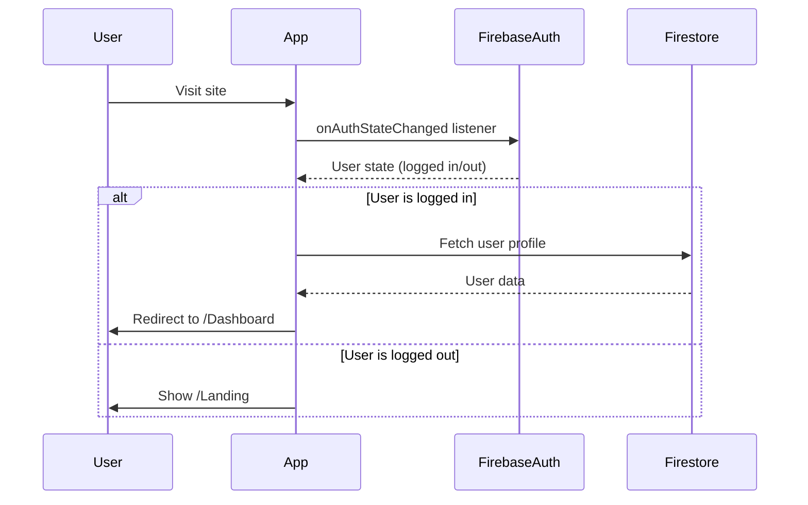
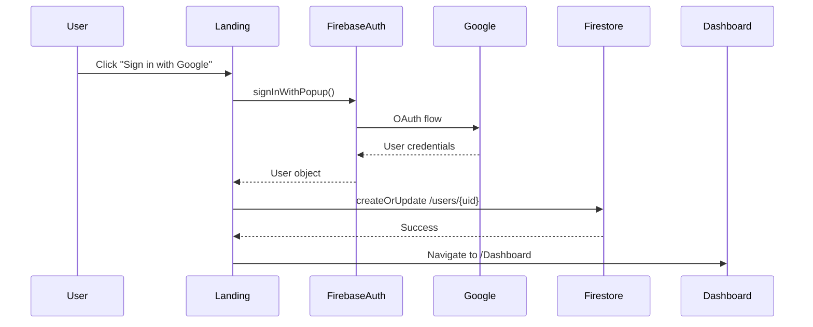
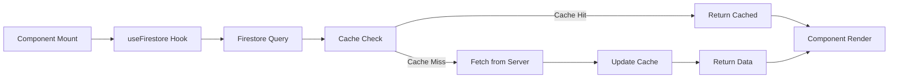
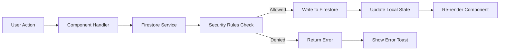

# 🏗️ CAO - Architecture Reference (Consultas CAO)

**Version:** 1.14.1 - Expedientes Administrativos  
**Last Updated:** 2026-03-31  
**Purpose:** Complete architectural documentation for the CAOCIPP platform

---

## Table of Contents

1. [System Overview](#system-overview)
2. [Technology Stack](#technology-stack)
3. [Project Structure](#project-structure)
4. [Data Architecture](#data-architecture)
5. [Component Architecture](#component-architecture)
6. [Authentication Flow](#authentication-flow)
7. [Data Flow](#data-flow)
8. [State Management](#state-management)
9. [API Integration](#api-integration)
10. [Performance Optimization](#performance-optimization)

---

## System Overview

### High-Level Architecture

```
┌─────────────────────────────────────────────────────────────┐
│                         FRONTEND                             │
│  ┌────────────┐  ┌────────────┐  ┌────────────┐            │
│  │   React    │  │  Tailwind  │  │  Radix UI  │            │
│  │   18.3.1   │  │    CSS     │  │    v1.0    │            │
│  └────────────┘  └────────────┘  └────────────┘            │
│         │                │                │                  │
│         └────────────────┴────────────────┘                  │
│                         │                                    │
│         ┌───────────────┴───────────────┐                   │
│         │   Firebase SDK 10.14.1        │                   │
│         └───────────────┬───────────────┘                   │
└─────────────────────────┼───────────────────────────────────┘
                          │
┌─────────────────────────┼───────────────────────────────────┐
│                    FIREBASE BACKEND                          │
│  ┌────────────┐  ┌────────────┐  ┌────────────┐            │
│  │   Auth     │  │ Firestore  │  │  Hosting   │            │
│  │  (Google)  │  │  Database  │  │    CDN     │            │
│  └────────────┘  └────────────┘  └────────────┘            │
└─────────────────────────────────────────────────────────────┘
```

### System Characteristics

- **Type:** Single Page Application (SPA)
- **Rendering:** Client-Side Rendering (CSR)
- **Architecture Pattern:** Component-Based Architecture
- **Data Layer:** Firebase Firestore (NoSQL)
- **Authentication:** Firebase Authentication (OAuth 2.0)
- **Hosting:** Firebase Hosting (CDN)
- **State Management:** React Context + Custom Hooks

---

## Technology Stack

### Core Technologies

| Technology | Version | Purpose | Documentation |
|------------|---------|---------|---------------|
| **React** | 18.3.1 | UI Framework | [React Docs](https://react.dev) |
| **Vite** | 6.0.5 | Build Tool | [Vite Docs](https://vitejs.dev) |
| **Firebase** | 10.14.1 | Backend Services | [Firebase Docs](https://firebase.google.com/docs) |
| **Tailwind CSS** | 3.4.17 | Styling | [Tailwind Docs](https://tailwindcss.com) |
| **Radix UI** | Various | UI Primitives | [Radix Docs](https://radix-ui.com) |

### Key Dependencies

```json
{
  "react": "^18.3.1",
  "react-dom": "^18.3.1",
  "react-router-dom": "^7.1.3",
  "firebase": "^10.14.1",
  "date-fns": "^4.1.0",
  "recharts": "^2.15.0",
  "lucide-react": "^0.468.0",
  "sonner": "^1.7.1",
  "@radix-ui/react-*": "Various"
}
```

### Development Tools

- **Package Manager:** npm
- **Linter:** ESLint
- **Code Formatter:** (configured in ESLint)
- **Git:** Version control
- **Firebase CLI:** Deployment

---

## Project Structure

### Directory Tree

```
CAOCIPP/
├── .agent/                      # AI agent configurations
│   ├── skills/                  # AI development skills
│   └── workflows/               # Development workflows
├── docs/                        # Documentation (THIS FOLDER)
│   ├── ARCHITECTURE_REFERENCE.md
│   ├── SECURITY_REFERENCE.md
│   ├── FEATURES_REFERENCE.md
│   ├── DESIGN_SYSTEM_REFERENCE.md
│   ├── GLOSSARY.md
│   └── DEVELOPMENT_GUIDE.md
├── functions/                   # Cloud Functions (placeholder)
│   └── index.js
├── public/                      # Static assets
│   └── logo.svg
├── src/                         # Source code
│   ├── api/                     # API clients (Consultas CAO - legacy)
│   │   └── consultasCaoClient.js
│   ├── components/              # React components
│   │   ├── organization/        # Organization-specific components
│   │   │   ├── CreateProcessButton.jsx
│   │   │   ├── CreateProcessDialog.jsx
│   │   │   ├── CreateExpedienteDialog.jsx
│   │   │   ├── EditProcessDialog.jsx
│   │   │   ├── EditExpedienteDialog.jsx
│   │   │   ├── ExpedienteControl.jsx
│   │   │   ├── ExpedienteTable.jsx
│   │   │   ├── ExpedienteDetailSheet.jsx
│   │   │   ├── ExpedienteKanbanBoard.jsx
│   │   │   ├── GeneralInfo.jsx
│   │   │   ├── IntelligentSummary.jsx
│   │   │   ├── ProcessControl.jsx
│   │   │   ├── ProcessForm.jsx
│   │   │   └── ProcessStatusBadge.jsx
│   │   ├── ui/                  # Reusable UI components (Radix)
│   │   │   ├── alert.jsx
│   │   │   ├── avatar.jsx
│   │   │   ├── badge.jsx
│   │   │   ├── button.jsx
│   │   │   ├── card.jsx
│   │   │   ├── dialog.jsx
│   │   │   ├── dropdown-menu.jsx
│   │   │   ├── input.jsx
│   │   │   ├── label.jsx
│   │   │   ├── select.jsx
│   │   │   ├── switch.jsx
│   │   │   ├── table.jsx
│   │   │   ├── tabs.jsx
│   │   │   └── textarea.jsx
│   │   └── ErrorBoundary.jsx    # Global error handler
│   ├── config/                  # Configuration
│   │   └── firebase.js          # Firebase initialization
│   ├── hooks/                   # Custom React hooks
│   │   └── useFirestore.js      # Firestore data hooks
│   ├── lib/                     # Libraries and contexts
│   │   └── FirebaseAuthContext.jsx
│   ├── pages/                   # Application pages
│   │   ├── Dashboard.jsx
│   │   ├── Landing.jsx
│   │   ├── Organization.jsx
│   │   └── Profile.jsx
│   ├── services/                # Business logic services
│   │   └── firestoreService.js
│   ├── utils/                   # Utility functions
│   │   ├── cn.js                # Class name merger
│   │   └── logger.js            # Logging utility
│   ├── App.jsx                  # Root component
│   ├── index.css                # Global styles
│   └── main.jsx                 # Entry point
├── .env                         # Environment variables (NOT in git)
├── .env.example                 # Environment template
├── .firebaserc                  # Firebase project reference
├── .gitignore                   # Git ignore rules
├── components.json              # Shadcn UI config
├── eslint.config.js             # ESLint configuration
├── firebase.json                # Firebase configuration
├── firestore.indexes.json       # Firestore indexes
├── firestore.rules              # Firestore security rules
├── index.html                   # HTML template
├── jsconfig.json                # JavaScript config
├── package.json                 # Dependencies
├── postcss.config.js            # PostCSS config
├── tailwind.config.js           # Tailwind configuration
└── vite.config.js               # Vite configuration
```

### Module Organization

#### Pages (Route Components)
- **Purpose:** Top-level route components
- **Location:** `src/pages/`
- **Naming:** PascalCase, e.g., `Dashboard.jsx`
- **Responsibilities:**
  - Route rendering
  - Data fetching via hooks
  - Layout composition
  - Props passing to components

#### Components (UI Components)
- **Purpose:** Reusable UI elements
- **Location:** `src/components/`
- **Naming:** PascalCase, e.g., `ProcessControl.jsx`
- **Types:**
  - **Container Components:** Manage state, fetch data
  - **Presentational Components:** Pure UI, receive props
  - **UI Primitives:** `src/components/ui/` (Radix-based)

#### Hooks (Custom React Hooks)
- **Purpose:** Reusable stateful logic
- **Location:** `src/hooks/`
- **Naming:** camelCase with 'use' prefix, e.g., `useFirestore.js`
- **Pattern:**
  ```javascript
  export function useCustomHook(params) {
    const [state, setState] = useState();
    // ... logic
    return { data, isLoading, error };
  }
  ```

#### Services (Business Logic)
- **Purpose:** CRUD operations, business rules
- **Location:** `src/services/`
- **Naming:** camelCase with 'Service' suffix
- **Pattern:**
  ```javascript
  export async function createEntity(data, userId) {
    // Validation
    // Firestore operations
    // Return result
  }
  ```

---

## Data Architecture

### Firestore Collections

#### 1. `users`
**Purpose:** User profiles and preferences

```javascript
{
  // Document ID: Firebase Auth UID
  email: string,                    // From Firebase Auth
  full_name: string,                // User's full name
  photo_url: string,                // Profile photo URL
  platform_name: string,            // Display name in app
  function: string,                 // User function/role
  notification_email: string,       // Optional notification email
  created_at: Timestamp,            // Document creation
  updated_at: Timestamp             // Last update
}
```

**Indexes:** None (primary key only)  
**Security:** User can only read/write their own document

#### 2. `organizations`
**Purpose:** Organization entities

```javascript
{
  // Document ID: Auto-generated
  name: string,                     // Organization name
  description: string,              // Organization description
  invite_code: string,              // 8-char invite code (UPPERCASE)
  created_by: string,               // Creator user_id (reference)
  created_at: Timestamp,            // Creation timestamp
  updated_at: Timestamp,            // Last update timestamp
  stats: {
    members_count: number,          // Total members
    processes_count: number,        // Total processes
    active_processes: number        // Non-archived processes
  }
}
```

**Indexes:**
- `invite_code` (single field, ascending)
- `created_by` (for user's organizations query)

**Security:** Read by members, write by creator

#### 3. `userOrganizations`
**Purpose:** User-Organization membership (junction table)

```javascript
{
  // Document ID: Composite "{user_id}_{organization_id}"
  id: string,                       // Composite key
  user_id: string,                  // Reference to users
  organization_id: string,          // Reference to organizations
  user_email: string,               // Denormalized from users
  user_name: string,                // Denormalized from users
  user_photo: string,               // Denormalized from users
  role: string,                     // 'creator' | 'admin' | 'member'
  function: string,                 // User's function in org
  joined_at: Timestamp,             // Membership creation
  updated_at: Timestamp             // Last update
}
```

**Indexes:**
- `user_id` + `organization_id` (composite)
- `organization_id` + `role` (composite)
- `organization_id` + `joined_at` (composite)

**Security:** Read by org members, write by creator

#### 4. `processes`
**Purpose:** Legal process tracking

```javascript
{
  // Document ID: Auto-generated
  organization_id: string,          // Reference to organizations
  process_number: string,           // Process identifier
  consultant: string,               // Consultant name
  location: string,                 // City/location
  entry_date: string,               // YYYY-MM-DD format
  matter_object: string,            // Process subject/matter
  status: string,                   // Process status
  urgency_request: boolean,         // Urgent flag
  responsible_user_id: string,      // Assigned user ID
  responsible_user_name: string,    // Denormalized user name
  distribution_date: string,        // Distribution date
  analysis_start_date: string,      // Analysis start
  review_submission_date: string,   // Sent to review
  review_return_date: string,       // Returned from review
  archived_date: string,            // Archived date
  observations: string,             // Notes
  decision: string,                 // Final decision
  access_restriction: boolean,      // Access restriction flag
  network_folder: string,           // Network path
  created_by: string,               // Creator user_id
  created_at: Timestamp,            // Creation timestamp
  updated_at: Timestamp,            // Last update
  updated_by: string,               // Last updater user_id
  last_imported_at: Timestamp,      // Last spreadsheet import (if any)
  activity_log: Array<{             // Per-process audit trail
    date: string,                   // YYYY-MM-DD
    time: string,                   // HH:MM:SS
    user_id: string,                // Who performed the action
    user_name: string,              // Human-readable name
    action: string,                 // Description of what changed
    timestamp: string               // ISO 8601 full timestamp
  }>
}
```

**Indexes:**
- `organization_id` + `created_at` (composite, descending)
- `organization_id` + `status` (composite)
- `organization_id` + `responsible_user_id` (composite)
- `organization_id` + `urgency_request` (composite)
- `organization_id` + `entry_date` (composite, descending)
- `organization_id` + `process_number` (composite)

**Security:** Read/write by org members, delete by creator/admin

#### 5. `expedientes`
**Purpose:** Administrative expedient tracking

```javascript
{
  // Document ID: Auto-generated
  organization_id: string,          // Reference to organizations
  expediente_number: string,        // Expediente identifier
  origin: string,                   // Origin/Source (SIM, GAB-PGJ, etc.)
  system: string,                   // System identifier
  entry_date: string,               // YYYY-MM-DD format
  matter: string,                   // Subject/Matter
  status: string,                   // Current status
  urgency_request: boolean,         // Urgent flag
  responsible_user_id: string,      // Assigned user ID
  responsible_user_name: string,    // Denormalized user name
  distribution_date: string,        // Distribution date
  analysis_start_date: string,      // Analysis start
  review_submission_date: string,   // Sent to review
  review_return_date: string,       // Returned from review
  archived_date: string,            // Archived date
  observations: string,             // Notes
  network_folder: string,           // Network path
  created_by: string,               // Creator user_id
  created_at: Timestamp,            // Creation timestamp
  updated_at: Timestamp,            // Last update
  updated_by: string,               // Last updater user_id
  activity_log: Array<{             // Per-expediente audit trail
    // (Same format as processes)
  }>
}
```

**Indexes:**
- `organization_id` + `created_at` (composite, descending)
- `organization_id` + `status` (composite)
- `organization_id` + `entry_date` (composite, descending)
- `organization_id` + `expediente_number` (composite)

**Security:** Read/write by org members, delete by creator/admin

#### 6. `notifications` (Optional - Placeholder)
**Purpose:** User notifications

```javascript
{
  user_id: string,
  organization_id: string,
  type: string,
  message: string,
  read: boolean,
  created_at: Timestamp
}
```

---

## Component Architecture

### Component Hierarchy

```
App
├── FirebaseAuthProvider (Context)
│   ├── ErrorBoundary
│   │   └── Router
│   │       ├── Landing (Public Route)
│   │       └── Private Routes (authenticated)
│   │           ├── Dashboard
│   │           │   ├── Header
│   │           │   ├── OrgSelector (if multiple orgs)
│   │           │   ├── KPI Cards
│   │           │   ├── Charts (Recharts)
│   │           │   └── ActivityList
│   │           ├── Profile
│   │           │   ├── ProfileForm
│   │           │   ├── OrganizationList
│   │           │   ├── CreateOrgDialog
│   │           │   └── JoinOrgDialog
│   │           └── Organization
│   │               ├── OrgSelector
│   │               ├── Tabs
│   │               │   ├── Tab: Informações
│   │               │   │   └── GeneralInfo
│   │               │   │       ├── OrgInfoCard
│   │               │   │       └── MembersTable
│   │               │   ├── Tab: Processos
│   │               │   │   └── ProcessControl
│   │               │   │       ├── CreateProcessButton
│   │               │   │       ├── Filters
│   │               │   │       ├── ProcessTable
│   │               │   │       ├── ProcessDetailSheet
│   │               │   │       ├── EditProcessDialog
│   │               │   │       │   └── ProcessLogDialog (admin only)
│   │               │   │       └── KanbanBoard
│   │               │   │           ├── KanbanCard (eye icon → ProcessDetailSheet)
│   │               │   │           └── KanbanTransitionDialog
│   │               │   ├── Tab: Expedientes
│   │               │   │   └── ExpedienteControl
│   │               │   │       ├── CreateExpedienteDialog
│   │               │   │       ├── ExpedienteTable
│   │               │   │       ├── ExpedienteDetailSheet
│   │               │   │       ├── EditExpedienteDialog
│   │               │   │       └── ExpedienteKanbanBoard
│   │               │   │           │   ├── ExpedienteKanbanCard (eye icon → ExpedienteDetailSheet)
│   │               │   │           │   └── (Transition Logic similar to processes)
│   │               │   └── Tab: Resumos
│   │               │       └── IntelligentSummary
│   │               │           ├── KPI Cards
│   │               │           └── Charts
```

### Component Communication Patterns

#### 1. Props Drilling (Parent → Child)
```javascript
// Parent
<ProcessControl 
  organization={organization}
  members={members}
  processes={processes}
/>

// Child receives and uses
function ProcessControl({ organization, members, processes }) {
  // Use props
}
```

#### 2. Context API (Global State)
```javascript
// Provider (in App.jsx)
<FirebaseAuthProvider>
  {children}
</FirebaseAuthProvider>

// Consumer (anywhere in tree)
const { user, signIn, signOut, isLoading } = useAuth();
```

#### 3. Custom Hooks (Data Fetching)
```javascript
// In component
const { organizations, isLoading, error } = useOrganizations();
const { processes } = useProcesses(organizationId);
```

#### 4. Callback Props (Child → Parent)
```javascript
// Parent defines callback
const handleProcessCreated = () => {
  // Refresh or update
};

// Pass to child
<CreateProcessDialog onSuccess={handleProcessCreated} />

// Child calls it
onSubmit={(data) => {
  createProcess(data);
  onSuccess(); // Notify parent
}}
```

---

## Authentication Flow

### Initial Load



### Login Process



### Protected Routes

```javascript
// In App.jsx
{user ? (
  <Route path="/Dashboard" element={<Dashboard />} />
) : (
  <Route path="*" element={<Navigate to="/" />} />
)}
```

---

## Data Flow

### Read Operations (Query Pattern)



### Write Operations (Mutation Pattern)



### Example: Creating a Process

```javascript
// 1. User clicks "Create Process"
<CreateProcessDialog onSuccess={refetch} />

// 2. Dialog submits data
const handleSubmit = async (formData) => {
  await createProcess({
    ...formData,
    organization_id: currentOrg.id
  }, user.uid);
};

// 3. Service performs operation
export async function createProcess(data, creatorUid) {
  const processRef = await addDoc(collection(db, 'processes'), {
    ...data,
    created_by: creatorUid,
    created_at: serverTimestamp()
  });
  
  // Update organization stats
  await updateDoc(doc(db, 'organizations', data.organization_id), {
    'stats.processes_count': increment(1)
  });
  
  return processRef.id;
}

// 4. Hook refreshes automatically
const { processes } = useProcesses(orgId);
// Processes list updates with new item
```

---

## State Management

### Context-Based State

**FirebaseAuthContext:**
- **Scope:** Global
- **Purpose:** Authentication state
- **Data:**
  ```javascript
  {
    user: User | null,
    isLoading: boolean,
    signInWithGoogle: () => Promise,
    signInWithGoogleRedirect: () => Promise,
    signOut: () => Promise
  }
  ```

### Local Component State

**useState Pattern:**
```javascript
const [formData, setFormData] = useState(initialState);
const [isOpen, setIsOpen] = useState(false);
const [selectedItem, setSelectedItem] = useState(null);
```

### Server State (via Hooks)

**useFirestore Hooks:**
```javascript
const { organizations, isLoading, error } = useOrganizations();
const { processes } = useProcesses(orgId, filters);
const { members } = useOrganizationMembers(orgId);
```

**Pattern:**
```javascript
export function useCustomData(params) {
  const [data, setData] = useState([]);
  const [isLoading, setIsLoading] = useState(true);
  const [error, setError] = useState(null);
  
  useEffect(() => {
    // Fetch logic
  }, [params]);
  
  return { data, isLoading, error };
}
```

---

## API Integration

### Firebase SDK Usage

#### Authentication
```javascript
import { auth } from '@/config/firebase';
import { signInWithPopup, GoogleAuthProvider } from 'firebase/auth';

const provider = new GoogleAuthProvider();
const result = await signInWithPopup(auth, provider);
```

#### Firestore Queries
```javascript
import { db } from '@/config/firebase';
import { collection, query, where, getDocs } from 'firebase/firestore';

const q = query(
  collection(db, 'processes'),
  where('organization_id', '==', orgId)
);
const snapshot = await getDocs(q);
```

#### Real-time Listeners
```javascript
import { onSnapshot } from 'firebase/firestore';

useEffect(() => {
  const unsubscribe = onSnapshot(
    doc(db, 'organizations', orgId),
    (doc) => {
      setOrganization(doc.data());
    }
  );
  return () => unsubscribe();
}, [orgId]);
```

---

## Performance Optimization

### Implemented Optimizations

1. **Firestore Indexes:**
   - 9 composite indexes for common queries
   - Prevents full collection scans

2. **Data Denormalization:**
   - `user_name` in memberships (avoid joins)
   - `responsible_user_name` in processes

3. **Lazy Loading:**
   - Components loaded only when needed
   - React Router code splitting ready

4. **Local State Management:**
   - Filtering/searching done client-side
   - Reduces server calls

5. **Memoization Opportunities:**
   - Calculated values can use `useMemo`
   - Callbacks can use `useCallback`

### Future Optimizations

- [ ] Implement pagination for large datasets
- [ ] Add React.lazy() for code splitting
- [ ] Cache frequently accessed data
- [ ] Implement optimistic UI updates
- [ ] Add service worker for offline support

---

## Deployment Architecture

### Development Environment
```
Local Machine
├── npm run dev → Vite Dev Server (http://localhost:5173)
└── Firebase Emulators (optional)
    ├── Auth Emulator
    ├── Firestore Emulator
    └── Functions Emulator
```

### Production Environment
```
Firebase Platform
├── Firebase Hosting → CDN Distribution
├── Firebase Authentication → User Management
├── Firestore → Database
└── Cloud Functions v2 → Backend Logic
    ├── createProcess → Process creation + activity_log init
    ├── updateProcess → Process updates + activity_log append
    ├── deleteProcess → Process deletion
    ├── importProcessesFromExcel → Spreadsheet import + field-level diff log
    ├── createExpediente → Expediente creation + activity_log init
    ├── updateExpediente → Expediente updates + activity_log append
    ├── deleteExpediente → Expediente deletion
    ├── importExpedientesFromExcel → Expediente spreadsheet import
    ├── backfillProcessLogs → One-time retroactive log generation
    ├── calculateProcessStatus → Status calculation
    └── calculateExpedienteStatus → Status calculation for expedientes
```

---

## Conclusion

This architecture provides:
- ✅ **Scalability:** Firebase serverless infrastructure
- ✅ **Security:** Granular Firestore rules
- ✅ **Performance:** Optimized indexes and denormalization
- ✅ **Maintainability:** Clear separation of concerns
- ✅ **Developer Experience:** Modern React patterns

For specific implementation details, see other reference documents:
- Security → `SECURITY_REFERENCE.md`
- Features → `FEATURES_REFERENCE.md`
- Design → `DESIGN_SYSTEM_REFERENCE.md`
